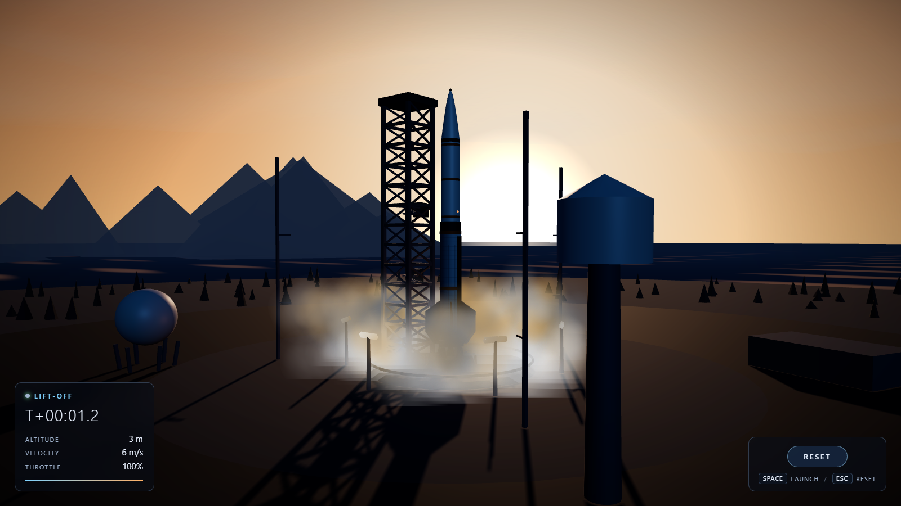

# Orbital Launch | 3D Rocket Experience

A stylized, fully procedural 3D rocket launch experience built with React, Vite, and Three.js. No external 3D models, textures, or media are loaded at runtime: the rocket, launch tower, terrain, ocean, sky, flame, and smoke are all generated in code, so the whole launch site runs from a single `npm install`.



## The launch sequence

One button press (or `Space`) plays a complete flight:

1. **Ready**: the rocket sits stationary on the pad while the camera holds a ground-level shot.
2. **Countdown**: T-6 s to ignition, with live HUD telemetry.
3. **Ignition**: engine glow ramps up, the flame cones light, and expanding exhaust and smoke roll out around the pad.
4. **Lift-off**: the hold-down clamps release and the vehicle climbs off the pad while the camera blends smoothly from the pad shot into an upward tracking shot.
5. **Ascent**: the rocket accelerates through haze into the upper atmosphere; the tracking camera follows and the field of view tightens for a sense of speed.
6. **Above range**: the flight reaches its mission ceiling and the HUD reports final altitude, velocity, and mission time.

## Controls

| Input | Action |
| --- | --- |
| Launch button / `Space` | Start the launch sequence |
| Reset button / `Escape` | Return to the pad, ready state |

## Running locally

```bash
npm install
npm run dev
```

Open the printed URL (Vite defaults to `http://localhost:5173/`). `npm run build` produces a production bundle and `npm run preview` serves it locally.

## Project structure

- `src/three/LaunchScene.js`: renderer, camera director, and the flight state machine (phases, throttle ramp, clamp release, camera blend, FOV zoom).
- `src/three/rocket.js`: procedural rocket, launch tower, and pad infrastructure.
- `src/three/environment.js`: terrain, ocean, sky, lighting, and fog.
- `src/three/effects.js`: engine flame, expanding smoke and exhaust, and the ignition shockwave.
- `src/three/textures.js`: canvas-generated textures, so the repo carries no image assets.
- `src/components/LaunchHud.jsx`: T-/T+ mission clock and telemetry readout.

Inspired by a reference launch video supplied in the workspace during development; the repo itself contains no video or binary art assets.

> Built with `DeepSeek-V4.1-Flash` using Codex Harness.